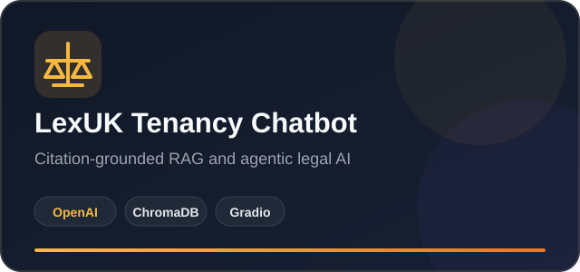
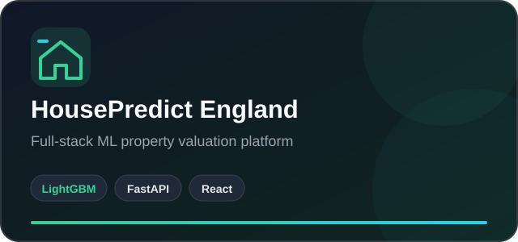
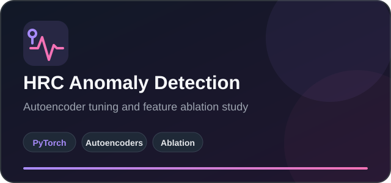
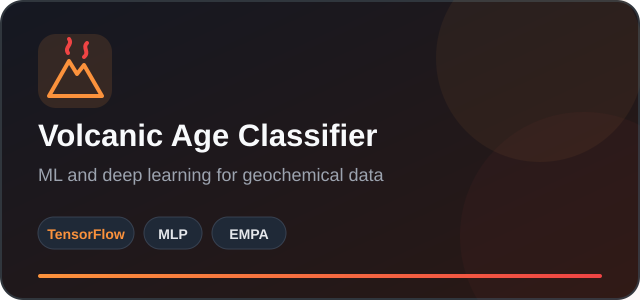

<div align="center">


<br />

[](https://www.linkedin.com/in/akif-hameed/)
[](https://www.akifhameed.com/)
[](https://github.com/akifhameed)

[](https://github.com/akifhameed)

<h1>Hi, I'm Akif Hameed </h1>

<hr />

<h3>🧠 MSc Computer Science @ LSBU London | ⚙️ AI and DevOps Engineer</h3>


</div>

---

## 🎯 About Me

```javascript
const akif = {
  location: "London, United Kingdom",
  education: "MSc Computer Science at London South Bank University",
  role: "AI and DevOps Engineer",
  experience: "4+ Years",
  currentMission: "Building AI applications that bridge human cognition and artificial intelligence",
  focus: ["Generative AI", "Deep Learning", "Agentic LLM Systems", "MLOps", "Cloud and DevOps"],
  lifeGoal: "Become an AI Solutions Architect"
};
```

🔭 **Current Mission**: Building AI applications that bridge human cognition and artificial intelligence

🌱 **Currently Exploring:** Anomaly detection in HRC, Multimodal transformers, model deployment and cloud-native AI architecture.

💼 **Professional Journey:** From Pakistan to UK (London), evolved from DevOps Engineer to AI Solution Architect.

🎯 **Long-Term Goal:** Grow into an AI Solutions Architect who can design secure, scalable and human-centred intelligent systems.

📬 **Let's Connect**: [](mailto:akifhameed.official@gmail.com)

---

## 🚀 Featured Products

Project titles open the live product wherever a public deployment is available. Each project also includes a separate source code link.

| Product | What I Built | Technology and Links |
|---|---|---|
| [**LexUK Tenancy Chatbot ↗**](https://huggingface.co/spaces/akifhameed/LexUK-Tenancy-Chatbot) | A citation-grounded RAG and agentic LLM assistant covering 12 UK tenancy statutes, with retrieval evaluation, citation validation and safe refusal behaviour. | Python, OpenAI API, ChromaDB, Gradio, Pydantic<br>[Live Product](https://huggingface.co/spaces/akifhameed/LexUK-Tenancy-Chatbot) · [Source Code](https://github.com/akifhameed/lexuk-tenancy-chatbot) |
| [**HousePredict England ↗**](https://house-predict-england.vercel.app/) | A full-stack residential valuation platform trained on approximately 4.5 million HM Land Registry transactions, with authentication, saved predictions and explainable results. | LightGBM, FastAPI, React, Tailwind CSS, Supabase<br>[Live Product](https://house-predict-england.vercel.app/) · [API Docs](https://house-predict-backend-ldy9.onrender.com/docs) · [Source Code](https://github.com/akifhameed/house-predict-england) |
| [**AWS Kubernetes CI/CD Pipeline**](https://github.com/akifhameed/akifhameed-portfolio) | A production-style DevOps project that packages a static web application with Docker, serves it through Nginx and automates deployment to Kubernetes on AWS EC2 through a Jenkins pipeline. | Docker, Kubernetes, Minikube, Jenkins, Nginx, AWS EC2<br>[Source Code](https://github.com/akifhameed/akifhameed-portfolio) |
| [**HRC Anomaly Detection**](https://github.com/akifhameed/hrc-anomaly-detection) | An ablation study using custom-developed, hyperparameter-tuned autoencoder models for anomaly detection in human-robot collaboration (HRC). | PyTorch, Autoencoder, Deep Autoencoder, Denoising Autoencoder, Variational Autoencoder, scikit-learn, Pandas, NumPy, Jupyter<br>[Source Code](https://github.com/akifhameed/hrc-anomaly-detection) |
| [**Volcanic Age Classifier**](https://github.com/akifhameed/volcanic-age-classifier) | An end-to-end ML and deep-learning workflow that predicts volcanic rock age classes from EMPA and Laser Ablation geochemical measurements. | TensorFlow, MLP Neural Network, Logistic Regression, SVM, scikit-learn, Pandas, NumPy, Matplotlib, Seaborn, Jupyter<br>[Source Code](https://github.com/akifhameed/volcanic-age-classifier) |

<div align="center">

<a href="https://huggingface.co/spaces/akifhameed/LexUK-Tenancy-Chatbot">
  
</a>
<a href="https://house-predict-england.vercel.app/">
  
</a>

<a href="https://github.com/akifhameed/hrc-anomaly-detection">
  
</a>
<a href="https://github.com/akifhameed/volcanic-age-classifier">
  
</a>

</div>

---

## 🛠️ Engineering Toolkit

### **Languages & Frameworks**


### **AI/ML Stack**


### **DevOps & Cloud**


### **Databases & Tools**


---

## 🏆 Achievements & Impact

| 💼 Experience | 🧭 Professional Roles | 🏅 Certifications | 🚀 Featured Projects |
|:---:|:---:|:---:|:---:|
| **4+ Years** | **3** | **8** | **5** |

### Key Highlights

✨ **4+ Years of Professional Experience**: Progressed from systems administration to DevOps engineering  
☁️ **Cloud and Container Delivery**: Worked with AWS, Docker, Linux and CI/CD workflows  
🏅 **Two AWS Certifications**: AWS Certified Cloud Practitioner and AWS Certified AI Practitioner  
🤖 **Applied AI Portfolio**: Built projects involving RAG, agentic LLMs, anomaly detection and deep learning  
🚀 **Five Featured Projects**: Covering legal AI, property valuation, DevOps automation, HRC anomaly detection and geochemical classification  
📚 **Continuous Learning**: Earned certifications across AWS, Kubernetes, Docker and web development

---

## 💼 Experience

### DevOps Engineer | Tycoon Soft

**Lahore · On-site | April 2023 to August 2025**

Built and maintained cloud-based deployment environments on AWS and containerised applications using Docker. Supported CI/CD pipelines, managed Linux servers and automated build and deployment processes to improve delivery reliability. Monitored system performance, troubleshot infrastructure and application issues, and collaborated with development teams to maintain secure, scalable and dependable services.

### Junior DevOps Engineer | Nexus Limited

**Lahore · On-site | March 2022 to March 2023**

Supported software delivery by maintaining CI/CD workflows, assisting with application deployments and monitoring development and production environments. Worked with Linux systems, version control and automation tools while troubleshooting build, configuration and deployment issues. Collaborated with developers to improve deployment reliability and maintained technical documentation for recurring operational processes.

### System Administrator | Nexus Limited

**Lahore · On-site | February 2021 to February 2022**

Administered Ubuntu Linux systems, managed user accounts and access permissions, and installed, configured and updated operating systems and software. Monitored system performance, services, storage and logs while troubleshooting hardware, software and network connectivity issues. Also supported security patching, system backups and technical documentation.

---

## 🎓 Education & Certifications

### Education

| Degree | Institution |
|---|---|
| **MSc Computer Science** | London South Bank University |

### Certifications

| Certification | Issuer | Issued | Credential |
|---|---|---|---|
| **AWS Certified Cloud Practitioner** | Amazon Web Services | August 2026 | [Verify](https://www.credly.com/badges/0359557d-f15b-4d9b-8d59-f7e2f98880ab/linked_in_profile) |
| **AWS Certified AI Practitioner** | Amazon Web Services | July 2026 | [Verify](https://www.credly.com/badges/2d77cb31-66e6-47ad-8770-742c5d8769fb/linked_in_profile) |
| **AWS Certified AI Practitioner** | KodeKloud | July 2026 | [View](https://learn.kodekloud.com/certificate/9b42063f-01e6-4d2f-8052-ceae70d1f5d4) |
| **AWS Cloud Practitioner (CLF-C02)** | KodeKloud | July 2026 | [View](https://learn.kodekloud.com/certificate/ceed2732-b673-4830-8f14-9b039de6691e) |
| **Kubernetes for the Absolute Beginners: Hands-on Tutorial** | KodeKloud | June 2026 | [View](https://learn.kodekloud.com/certificate/9f0121c9-1f54-476d-9d10-daba55534367) |
| **Docker Training Course for the Absolute Beginner** | KodeKloud | February 2026 | [View](https://learn.kodekloud.com/certificate/940464c5-b90e-406e-a7b2-e1d7ae8764d8) |
| **NFTP Training: Technical Domain** | National Freelance Training Program | July 2021 | Listed on LinkedIn |
| **CS506: Web Design and Development** | Virtual University of Pakistan | January 2015 | Listed on LinkedIn |

---

## 📊 GitHub Analytics

<div align="center">


</div>

---

## 🔥 Current Focus

| Applied AI | Cloud and DevOps |
|---|---|
| Citation-grounded RAG systems | Containerised application delivery |
| Agentic LLM workflows | Kubernetes deployment patterns |
| Retrieval and generation evaluation | CI/CD automation with Jenkins |
| Reliable AI behaviour and refusals | Cloud infrastructure on AWS |
| Full-stack AI product development | Monitoring, testing and production readiness |

---

## 🌐 Let's Connect

I am open to AI engineering, Applied AI, DevOps and AI Solutions Architecture opportunities in the UK. I also enjoy connecting with people who are building useful technology with real-world impact.

<div align="center">

[](https://www.akifhameed.com/)
[](https://www.linkedin.com/in/akif-hameed/)
[](mailto:akifhameed.official@gmail.com)

### Building reliable AI systems from idea to production.

</div>
