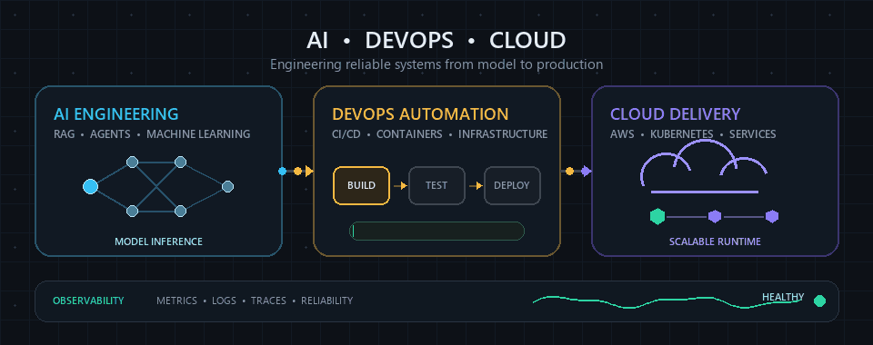
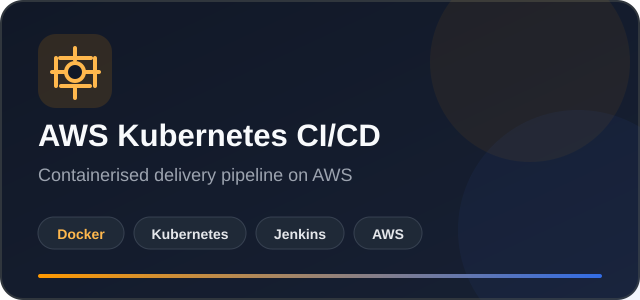
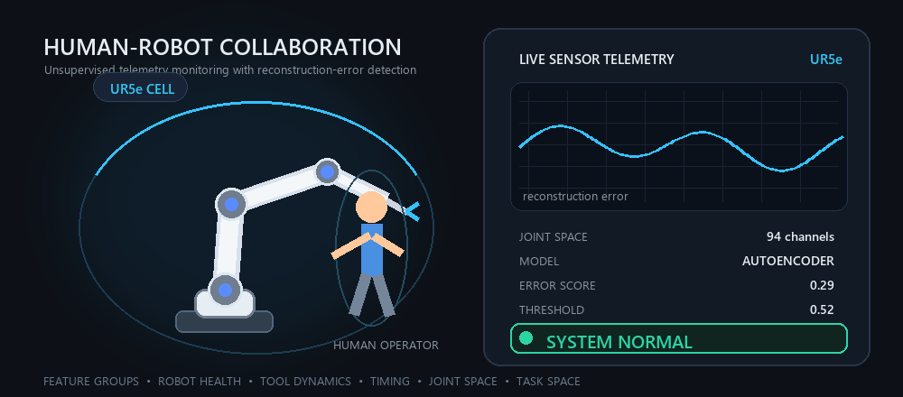

<div align="center">


<br />

[](https://www.linkedin.com/in/akif-hameed/)
[](https://www.akifhameed.com/)
[](https://github.com/akifhameed)

[](https://github.com/akifhameed)

<h1>Hi, I'm Akif Hameed </h1>

<hr />

<h3>🧠 MSc Computer Science @ LSBU London | ⚙️ AI and DevOps Engineer</h3>



</div>

---

## 🎯 About Me

```javascript
const akif = {
  location: "London, United Kingdom",
  education: "MSc Computer Science at London South Bank University",
  role: "AI and DevOps Engineer",
  experience: "4+ Years",
  currentMission: "Building AI applications that bridge human cognition and artificial intelligence",
  focus: ["Generative AI", "Deep Learning", "Agentic LLM Systems", "MLOps", "Cloud and DevOps"],
  lifeGoal: "Become an AI Solutions Architect"
};
```

🔭 **Current Mission**: Building AI applications that bridge human cognition and artificial intelligence

🌱 **Currently Exploring:** Anomaly detection in HRC, Multimodal transformers, model deployment and cloud-native AI architecture.

💼 **Professional Journey:** From Pakistan to London, progressing from DevOps engineering towards AI Solutions Architecture.

🎯 **Long-Term Goal:** Grow into an AI Solutions Architect who can design secure, scalable and human-centred intelligent systems.

📬 **Let's Connect**: [](mailto:akifhameed.official@gmail.com)

---

## 🚀 Featured Projects

Five selected projects spanning agentic AI, applied machine learning, robotics research and cloud delivery. The LexUK and HousePredict cards open the live products; the remaining cards open their source repositories.

<div align="center">

<a href="https://huggingface.co/spaces/akifhameed/LexUK-Tenancy-Chatbot">
  
</a>
<a href="https://house-predict-england.vercel.app/">
  
</a>

<sub>[LexUK Source Code](https://github.com/akifhameed/lexuk-tenancy-chatbot) · [HousePredict Source Code](https://github.com/akifhameed/house-predict-england) · [HousePredict API Docs](https://house-predict-backend-ldy9.onrender.com/docs)</sub>

<a href="https://github.com/akifhameed/hrc-anomaly-detection">
  
</a>
<a href="https://github.com/akifhameed/volcanic-age-classifier">
  
</a>

<a href="https://github.com/akifhameed/akifhameed-portfolio">
  
</a>

</div>

---

## 🛠️ Engineering Toolkit

### **Languages & Frameworks**


### **AI/ML Stack**


### **DevOps & Cloud**


### **Databases & Tools**


---

## 🏆 Achievements & Impact

| 💼 Experience | 🧭 Career Stages | 🏅 Certifications | 🚀 Featured Projects |
|:---:|:---:|:---:|:---:|
| **4+ Years** | **3** | **8** | **5** |

### Key Highlights

✨ **4+ Years of Professional Experience**: Progressed from systems administration to DevOps engineering  
☁️ **Cloud and Container Delivery**: Worked with AWS, Docker, Linux and CI/CD workflows  
🏅 **Two AWS Certifications**: AWS Certified Cloud Practitioner and AWS Certified AI Practitioner  
🤖 **Applied AI Portfolio**: Built projects involving RAG, agentic LLMs, anomaly detection and deep learning  
🧪 **HRC Research**: Compared tuned autoencoder families through feature-group ablation and ROC-AUC and PR-AUC evaluation  
🚀 **Five Featured Projects**: Covering legal AI, property valuation, DevOps automation, HRC anomaly detection and geochemical classification  
📚 **Continuous Learning**: Earned certifications across AWS, Kubernetes, Docker and web development

---

## 💼 Experience

### DevOps Engineer | Tycoon Soft

**Lahore · On-site | April 2023 to August 2025**

Built and maintained cloud-based deployment environments on AWS and containerised applications using Docker. Supported CI/CD pipelines, managed Linux servers and automated build and deployment processes to improve delivery reliability. Monitored system performance, troubleshot infrastructure and application issues, and collaborated with development teams to maintain secure, scalable and dependable services.

### Junior DevOps Engineer | Nexus Limited

**Lahore · On-site | March 2022 to March 2023**

Supported software delivery by maintaining CI/CD workflows, assisting with application deployments and monitoring development and production environments. Worked with Linux systems, version control and automation tools while troubleshooting build, configuration and deployment issues. Collaborated with developers to improve deployment reliability and maintained technical documentation for recurring operational processes.

### System Administrator | Nexus Limited

**Lahore · On-site | February 2021 to February 2022**

Administered Ubuntu Linux systems, managed user accounts and access permissions, and installed, configured and updated operating systems and software. Monitored system performance, services, storage and logs while troubleshooting hardware, software and network connectivity issues. Also supported security patching, system backups and technical documentation.

---

## 🎓 Education & Certifications

### Education

| Degree | Institution | Research Area |
|---|---|---|
| **MSc Computer Science** | London South Bank University | Anomaly detection in human-robot collaboration using autoencoder model families, hyperparameter tuning and feature-group ablation |

### Certifications

| Certification | Issuer | Issued | Credential |
|---|---|---|---|
| **AWS Certified Cloud Practitioner** | Amazon Web Services | August 2026 | [Verify](https://www.credly.com/badges/0359557d-f15b-4d9b-8d59-f7e2f98880ab/linked_in_profile) |
| **AWS Certified AI Practitioner** | Amazon Web Services | July 2026 | [Verify](https://www.credly.com/badges/2d77cb31-66e6-47ad-8770-742c5d8769fb/linked_in_profile) |
| **AWS Certified AI Practitioner** | KodeKloud | July 2026 | [View](https://learn.kodekloud.com/certificate/9b42063f-01e6-4d2f-8052-ceae70d1f5d4) |
| **AWS Cloud Practitioner (CLF-C02)** | KodeKloud | July 2026 | [View](https://learn.kodekloud.com/certificate/ceed2732-b673-4830-8f14-9b039de6691e) |
| **Kubernetes for the Absolute Beginners: Hands-on Tutorial** | KodeKloud | June 2026 | [View](https://learn.kodekloud.com/certificate/9f0121c9-1f54-476d-9d10-daba55534367) |
| **Docker Training Course for the Absolute Beginner** | KodeKloud | February 2026 | [View](https://learn.kodekloud.com/certificate/940464c5-b90e-406e-a7b2-e1d7ae8764d8) |
| **NFTP Training: Technical Domain** | National Freelance Training Program | July 2021 | [LinkedIn document](https://www.linkedin.com/in/akif-hameed/overlay/Certifications/2031324207/treasury/?profileId=ACoAAGJFVikBODsH_6oqgQdWI_C43LsBNlKfk0Y) |
| **CS506: Web Design and Development** | Virtual University of Pakistan | January 2015 | [LinkedIn document](https://www.linkedin.com/in/akif-hameed/overlay/Certifications/2005406800/treasury/?profileId=ACoAAGJFVikBODsH_6oqgQdWI_C43LsBNlKfk0Y) |

---

## 📊 GitHub Analytics

<div align="center">


</div>

---

## 🔥 Current Focus

<table>
<tr>
<td width="50%" valign="top">

### 🧠 AI/ML Research

- Unsupervised anomaly detection in human-robot collaboration
- Autoencoder, deep autoencoder, denoising autoencoder and β-VAE comparisons
- Feature-group ablation across robot health, tool dynamics, timing, joint space and task space
- Hyperparameter tuning across bottleneck size, batch size and activation functions
- Model evaluation with ROC-AUC and PR-AUC
- Citation-grounded RAG and agentic LLM systems

</td>
<td width="50%" valign="top">

### ☁️ Cloud and DevOps

- Containerised delivery with Docker and Kubernetes
- CI/CD automation with Jenkins and GitHub Actions
- AWS infrastructure and Terraform workflows
- Helm and Argo CD deployment patterns
- Monitoring with Prometheus, Grafana and OpenTelemetry
- Secure, observable and production-ready AI services

</td>
</tr>
</table>

---

## 🌐 Let's Connect

I am open to AI engineering, Applied AI, DevOps and AI Solutions Architecture opportunities. I also enjoy connecting with people who are building useful technology with real-world impact.

<div align="center">

[](https://www.akifhameed.com/)
[](https://www.linkedin.com/in/akif-hameed/)
[](mailto:akifhameed.official@gmail.com)

### Building reliable AI systems from idea to production.

</div>

---

## 🤖 Research in Motion

<div align="center">

### 🎯 Detecting Anomalies in Human-Robot Collaboration



*An original visual inspired by my HRC research: robot telemetry is reconstructed by an autoencoder, and abnormal reconstruction error triggers an anomaly alert.*

</div>
